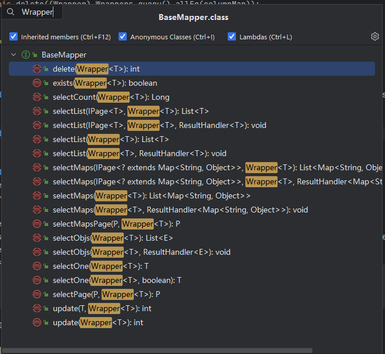

[TOC]

# 【README】

本文代码参见： [https://github.com/TomJourney/mybatis-plus-test](https://github.com/TomJourney/mybatis-plus-test)

本文集成了springboot与mybatis-plus；

本文主要内容如下：

- MybatisPlus常见注解；
- MybatisPlus常见配置；
- 条件构造器；
- 自定义sql；
- IService接口；

<br>

---

# 【1】MyBatis-plus常见注解

【注解官方使用文档】[https://baomidou.com/reference/annotation/](https://baomidou.com/reference/annotation/) 

1）MybatisPlus通过扫描实体类，并基于反射获取po类信息作为数据库表信息；默认规则如下：

- 类名驼峰转下划线作为表名； 
- 名为id的字段作为主键；
- 变量名驼峰转下划线作为表的字段名； 

<font color=red>补充：若po类的字段与数据库表字段不满足上述默认规则，则需要使用注解来做自定义（这就是注解的作用，非常重要） </font>； 

2）注解（修饰po）：

- @TableName： 设置表名； 
- @TableId：指定表中的主键字段；
- @TableField：指定表中的普通字段；

```java
@Data
@TableName("user_tbl")
public class UserPO {
    @TableId("idXXX")
    private Long id;

    @TableField("nameXXX")
    private String name;

    private String mobilePhone;

    private String addr;
}
```

<br>

---

# 【2】MyBatis-Plus常见配置

mybatis-plus常见配置官方文档：[https://baomidou.com/reference/](https://baomidou.com/reference/)

## 【2.1】MyBatis-Plus配置示例

```properties
# 更多配置可以参考：  https://baomidou.com/reference/
# 别名扫描包
mybatis-plus.type-aliases-package=com.tom.study.mybatisplustest.infrastructure.dao

# mapper.xml路径
mybatis-plus.mapper-locations=classpath*:com.tom.study.mybatisplustest.infrastructure.dao/**/*.xml

# 配置
# 是否开启下划线和驼峰的映射
mybatis-plus.configuration.map-underscore-to-camel-case=true
# 是否开启二级缓存
mybatis-plus.configuration.cache-enabled=false

# 全局配置
# 更新策略： 只更新非空字段 
mybatis-plus.global-config.db-config.update-strategy=not_null
```

<br>

---

# 【3】MyBatisPlus核心内容

## 【3.1】条件构造器

1）MybatisPlus支持各种复杂的where条件，Wrapper类就是构建条件的包装器，该类定义了多种方法用于抽象sql条件（where子句）；




<br>

---

### 【3.1.1】业务场景1-带多字段条件的查询-使用QueryWrapper

【业务场景】查询id大于100且名字包含6的用户

sql语句伪代码： select * from table where id > 100 and name like %6%；【说明：本sql仅供参考，生产环境不要使用】

【构建查询语句，封装到QueryWrapper】qryByCondition01()

```java
@Service
public class UserAppService {

    @Autowired
    UserMapper userMapper;
  

    public List<UserPO> qryByCondition01() {
        QueryWrapper<UserPO> userPOQueryWrapper = new QueryWrapper<UserPO>()
                .select("id", "name", "addr")
                .like("name", "6")
                .ge("id", 100);
        // 查询
        return userMapper.selectList(userPOQueryWrapper);
    }
}
```

【sql执行日志】 

```c++
==>  Preparing: SELECT id,name,addr FROM user_tbl WHERE (name LIKE ? AND id >= ?)
==> Parameters: %6%(String), 100(Integer)
<==    Columns: id, name, addr
<==        Row: 106, tr106, 成都市天府大道106号
<==        Row: 116, tr116, 成都市天府大道116号
<==      Total: 2
```

<br>

---

### 【3.1.2】业务场景2-带条件的更新-使用QueryWrapper

【业务场景】根据name等于user2的用户的地址addr，手机号码mobilePhone； 

sql语句伪代码： update table set addr='XXX', mobile_phone='XXX' where name='user2'；【说明：本sql仅供参考，生产环境不要使用】

【构建更新的where子句，封装到QueryWrapper】updateByCondition02()

```java
public void updateByCondition2() {
    QueryWrapper<UserPO> updateWrapper = new QueryWrapper<UserPO>()
            .eq("name", "user2");
    UserPO userPO = new UserPO();
    userPO.setAddr("成都天府四街401号");
    userPO.setMobilePhone("110");
    userMapper.update(userPO, updateWrapper);
}
```

【sql执行日志】

```c++
JDBC Connection [com.mysql.cj.jdbc.ConnectionImpl@774e182c] will not be managed by Spring
==>  Preparing: UPDATE user_tbl SET mobile_phone=?, addr=? WHERE (name = ?)
==> Parameters: 110(String), 成都天府四街401号(String), user2(String)
<==    Updates: 1
```

<br>

---

### 【3.1.3】业务场景3-带条件对字段做计算-使用UpdateWrapper

【业务场景】更新id为4,5,6的用户的余额，都加500元（消费券）； 

sql语句伪代码： update table set balance = balance + 500  where id in (4,5,6)；【说明：本sql仅供参考，生产环境不要使用】

【构建更新的where子句，封装到UpdateWrapper】updateByCondition03()

```java
public void updateByCondition3() {
        UpdateWrapper<UserPO> updateWrapper = new UpdateWrapper<UserPO>()
                .setSql("balance = balance + 500")
                .in("id", Arrays.asList(4, 5, 6));
        userMapper.update(null, updateWrapper);
    }
```

【sql执行日志】

```c++
JDBC Connection [com.mysql.cj.jdbc.ConnectionImpl@7d18e48f] will not be managed by Spring
==>  Preparing: UPDATE user_tbl SET balance = balance + 500 WHERE (id IN (?,?,?))
==> Parameters: 4(Integer), 5(Integer), 6(Integer)
<==    Updates: 3
```

<br>

---

### 【3.1.4】lambda语法的QueryWrapper-使用LambdaQueryWrapper

```java
public List<UserPO> qryByLambdaCondition04() {
    LambdaQueryWrapper<UserPO> userPOQueryWrapper = new LambdaQueryWrapper<UserPO>()
            .select(UserPO::getId, UserPO::getName, UserPO::getAddr)
            .like(UserPO::getName, "6")
            .ge(UserPO::getId, 100);
    // 查询
    return userMapper.selectList(userPOQueryWrapper);
}
```

【sql日志】

```c++
==>  Preparing: SELECT id,name,addr FROM user_tbl WHERE (name LIKE ? AND id >= ?)
==> Parameters: %6%(String), 100(Integer)
<==    Columns: id, name, addr
<==        Row: 106, tr106, 成都市天府大道106号
<==        Row: 116, tr116, 成都市天府大道116号
<==      Total: 2
```

<br>

---

# 【4】自定义sql（MyBatisPlus的优缺点）

1）应用场景：使用mybatisPlus的Wrapper构建复杂的where条件，然后自定义sql语句中剩下的部分；

2）<font color=red>MyBatisPlus的优缺点： </font>

- 优点：能够容易定义where子句的查询条件；
- 缺点：不容易定义where关键字之前的sql，如聚合函数count(),avg()等 （如sql= select user_state, count(1) from table where id in (1,2,3) group by user_state)；

## 【4.1】MyBatisPlus使用自定义sql的场景

【业务场景】更新id为4,5,6的用户的余额，都加500元。

### 【第1步】构建更新条件-使用LambdaQueryWrapper

```java
public void updateBalanceByDiySql() {
        LambdaQueryWrapper<UserPO> userPOQueryWrapper = new LambdaQueryWrapper<UserPO>()
                .in(UserPO::getId, List.of(4, 5, 6));
        // 更新
        userMapper.updateBalance(userPOQueryWrapper, new BigDecimal("500"));
    }
```

### 【第2步】mapper方法中使用@Param注解声明wrapper实例名称为ew（而且必须为ew）

```java
public interface UserMapper extends BaseMapper<UserPO> {

    void updateBalance(@Param("ew")LambdaQueryWrapper<UserPO> wrapper, @Param("balance")BigDecimal balance);
}
```

补充：也可以使用常量Constants.WRAPPER获取ew值；

### 【第3步】自定义sql，使用Wrapper条件

【UserMapper.xml】 UserMapper.xml与UserMapper.java 在同一个package下； 

```xml
<?xml version="1.0" encoding="UTF-8"?>
<!DOCTYPE mapper PUBLIC "-//mybatis.org//DTD Mapper 3.0//EN" "http://mybatis.org/dtd/mybatis-3-mapper.dtd">
<mapper namespace="com.tom.study.mybatisplustest.infrastructure.dao.user.mapper.UserMapper">

    <update id="updateBalance">
        update user_tbl set balance = balance + #{balance} ${ew.customSqlSegment}
    </update>
</mapper>
```

【sql日志】

```c++
==>  Preparing: update user_tbl set balance = balance + ? WHERE (id IN (?,?,?))
==> Parameters: 500(BigDecimal), 4(Integer), 5(Integer), 6(Integer)
<==    Updates: 3
```

<br>

---

# 【5】MyBatisPlus提供的Service接口（IService）

1）MyBatisPlus提供的IService接口：自定义多个增删改查方法api；

- ServiceImpl 实现了 IService，业务逻辑可以不用实现IService，而继承ServiceImpl ；因为实现IService，需要重写其所有方法，非常麻烦；

## 【5.1】继承ServiceImpl 类

### 【5.1.1】使用ServiceImpl接口更新用户余额

```java
public interface UserMapper extends BaseMapper<UserPO> {

    void updateBalance(@Param("ew") LambdaQueryWrapper<UserPO> wrapper, @Param("balance") BigDecimal balance);
}

// 继承MybatisPlus的ServiceImpl，ServiceImpl实现了MybatisPlus的IService接口
@Service
public class MyBatisPlusUserService extends ServiceImpl<UserMapper, UserPO> {

}

// 单元测试
@SpringBootTest
public class MyBatisPlusUserServiceTest {

    @Autowired
    private MyBatisPlusUserService userService;

    @Test
    void testSaveUser() {
        UserPO userPO = new UserPO();
        userPO.setId(123001L);
        userPO.setName("张三001");
        userPO.setMobilePhone("19912340001");
        userPO.setAddr("成都天府五街001号");
        userService.save(userPO);
    }

}
```

【代码说明】

- UserMapper 仅继承BaseMapper，无需写其他代码； 
- MyBatisPlusUserService 继承ServiceImpl，无需写其他代码；
- 单元测试：调用MyBatisPlusUserService.save()方法，实际上调用的是ServiceImpl.save()方法；


【sql运行日志】

```c++
==>  Preparing: INSERT INTO user_tbl ( id, name, mobile_phone, addr ) VALUES ( ?, ?, ?, ? )
==> Parameters: 123001(Long), 张三001(String), 19912340001(String), 成都天府五街001号(String)
<==    Updates: 1
```

【补充】MyBatisPlus-ServiceImpl代码结构；

```java
// 业务service
@Service
public class MyBatisPlusUserService extends ServiceImpl<UserMapper, UserPO> {
}

// MyBatisPlus的ServiceImpl定义，继承CrudRepository,并实现IService
public class ServiceImpl<M extends BaseMapper<T>, T> extends CrudRepository<M, T> implements IService<T> {
    public ServiceImpl() {
    }
}

// MybatisPlus-IService定义，继承 IRepository 
public interface IService<T> extends IRepository<T> {
    @Transactional(
        rollbackFor = {Exception.class}
    )
    default boolean saveBatch(Collection<T> entityList) {
        return this.saveBatch(entityList, 1000);
    }

    @Transactional(
        rollbackFor = {Exception.class}
    )
    default boolean saveOrUpdateBatch(Collection<T> entityList) {
        return this.saveOrUpdateBatch(entityList, 1000);
    }

    @Transactional(
        rollbackFor = {Exception.class}
    )
    default boolean removeBatchByIds(Collection<?> list) {
        return this.removeByIds(list);
    }

    @Transactional(
        rollbackFor = {Exception.class}
    )
    default boolean updateBatchById(Collection<T> entityList) {
        return this.updateBatchById(entityList, 1000);
    }
}

// IRepository 定义：
public interface IRepository<T> {
    int DEFAULT_BATCH_SIZE = 1000;

    default boolean save(T entity) {
        return SqlHelper.retBool(this.getBaseMapper().insert(entity));
    }

    boolean saveBatch(Collection<T> entityList, int batchSize);

    boolean saveOrUpdateBatch(Collection<T> entityList, int batchSize);
    // 增删改查api... 
}
```

<br>

---

### 【5.1.2】使用ServiceImpl接口查询用户信息

【测试案例】

```java
@Test
void testQuery() {
    List<UserPO> userPOS = userService.listByIds(List.of(1, 2, 3, 4));
    System.out.println(userPOS);
}

```

【sql日志】

```c++
==>  Preparing: SELECT id,name,mobile_phone,addr FROM user_tbl WHERE id IN ( ? , ? , ? , ? )
==> Parameters: 1(Integer), 2(Integer), 3(Integer), 4(Integer)
<==    Columns: id, name, mobile_phone, addr
<==        Row: 1, user1, 17612342701, 成都天府三街101号
<==        Row: 2, user2, 110, 成都天府四街401号
<==        Row: 3, user3, 17612342703, 成都天府三街103号
<==        Row: 4, user4, 17612342704, 成都天府三街104号
<==      Total: 4
```

<br>

---

## 【5.2】基于restful风格实现下列接口

1）需求： 基于restful实现下面接口：


<br>

---

### 【5.2.1】restfulApi使用MyBatisPlus(无需编写业务dao，自定义业务service继承MyBatisPlus-ServiceImpl即可)

【RestfulUserController】restful风格的用户控制器

```java
@RestController
@RequestMapping("/restful/user")
@RequiredArgsConstructor
public class RestfulUserController {

    private final MyBatisPlusUserService myBatisPlusUserService;

    private final UserConverter userConverter;

    @PostMapping(path = "/saveUser", consumes = "application/json")
    public void saveUser(@RequestBody UserFormDTO userFormDTO) {
        myBatisPlusUserService.save(userConverter.toUserPO(userFormDTO));
    }

    @DeleteMapping(path = "/deleteUser/{id}", consumes = "application/json")
    public void deleteUser(@PathVariable("id") Long id) {
        myBatisPlusUserService.removeById(id);
    }

    @GetMapping(path = "/queryUserById/{id}", consumes = "application/json")
    public UserVO queryUserById(@PathVariable("id") Long id) {
        UserPO userPO = myBatisPlusUserService.getById(id);
        return userConverter.toUserVO(userPO);
    }

    @GetMapping(path = "/queryUserByIds", consumes = "application/json")
    public List<UserVO> queryUserByIds(@RequestParam("ids") List<Long> ids) {
        List<UserPO> userPOList = myBatisPlusUserService.listByIds(ids);
        return userConverter.toUserVOList(userPOList);
    }
}
```

【MyBatisPlusUserService】

自定义service继承ServiceImpl，ServiceImpl由MyBatisPlus提供，其实现了IService的所有增删改查接口；

```java
@Service
public class MyBatisPlusUserService extends ServiceImpl<UserMapper, UserPO> {
}
```

【UserConverter】pojo转换器(采用MapStruct工具)

```java
@Mapper(componentModel = MappingConstants.ComponentModel.SPRING, unmappedTargetPolicy = ReportingPolicy.IGNORE)
public interface UserConverter {

    UserPO toUserPO(UserFormDTO userFormDTO);

    UserFormDTO toUserFormDTO(UserPO userPO);

    UserVO toUserVO(UserPO userPO);

    List<UserVO> toUserVOList(List<UserPO> userPOList);
}
```

<br>

---

【请求url】

根据id查询：localhost:8081/restful/user/queryUserById/1

保存：localhost:8081/restful/user/saveUser

```json
{
    "id": 100,
    "name": "user100",
    "mobilePhone": "17712340100",
    "addr": "成都天府三街100号"
}
```

删除：localhost:8081/restful/user/deleteUser/100

根据id列表查询：localhost:8081/restful/user/queryUserByIds?ids=110,111

<br>

---

## 【5.3】自定义用户Mapper（ServiceImpl无法满足复杂业务逻辑的情况）

### 【5.3.1】代码实现 

【RestfulUserController】 控制器层 

```java
@RestController
@RequestMapping("/restful/user")
@RequiredArgsConstructor
public class RestfulUserController {

    private final MyBatisPlusUserService myBatisPlusUserService;

    private final UserConverter userConverter;

    @PutMapping("/{id}/deductBalanceById/{money}")
    public void deductBalanceById(@PathVariable("id") long id, @PathVariable("money")BigDecimal money) {
        myBatisPlusUserService.deductBalance(id, money);
    }
}
```

【MyBatisPlusUserService】

```java
@Service
public class MyBatisPlusUserService extends ServiceImpl<UserMapper, UserPO> {
    public void deductBalance(long id, BigDecimal money) {
        // 1 查询用户
        UserPO userPO = this.getById(id);
        // 2 校验用户状态
        if (Objects.isNull(userPO) || "0".equals(userPO.getUserState())) {
            throw new RuntimeException("用户状态异常");
        }
        // 3 校验余额是否充足
        if (userPO.getBalance().compareTo(money) < 0) {
            throw new RuntimeException("用户余额不足");
        }
        // 4 扣减余额 update table set balance = balance - money where id = #{id}
        baseMapper.updateBalanceV2(id, money);
        //    ==>  Preparing: update user_tbl set balance = balance - ? where id = ?
        //            ==> Parameters: 150(BigDecimal), 1000(Long)
        //            <==    Updates: 1
    }
}
```

【UserMapper】自定义mapper方法 

```java
public interface UserMapper extends BaseMapper<UserPO> {

    void updateBalance(@Param(Constants.WRAPPER) LambdaQueryWrapper<UserPO> wrapper, @Param("balance") BigDecimal balance);

    @Update("update user_tbl set balance = balance - #{money} where id = #{id}")
    void updateBalanceV2(@Param("id") long id, @Param("money") BigDecimal money);
}
```

<br>

---

### 【5.3.2】测试效果

路径：localhost:8081/restful/user/1000/deductBalanceById/150

方法：PUT

<br>

---

# 【6】IService的lambda方法

## 【6.1】IService-lambda方法实现多条件复杂查询

业务场景：实现一个根据复杂条件查询用户的接口， 查询条件如下：根据用户名，用户状态，余额范围查询；上述3个查询字段，为空则跳过，不为空才作为查询条件；

【RestfulUserController】

```java
@RestController
@RequestMapping("/restful/user")
@RequiredArgsConstructor
public class RestfulUserController {

    private final MyBatisPlusUserService myBatisPlusUserService;

    private final UserConverter userConverter;

    @PostMapping(path = "/queryUserByMultiCondition", consumes = "application/json")
    public List<UserVO> queryUserByMultiCondition(@RequestBody UserQueryDTO userQueryDTO) {
        List<UserPO> userPOList = myBatisPlusUserService.queryUserByMultiCondition(userQueryDTO);
        return userConverter.toUserVOList(userPOList);
    }
}
```

【MyBatisPlusUserService】

```java
@Service
public class MyBatisPlusUserService extends ServiceImpl<UserMapper, UserPO> {
        public List<UserPO> queryUserByMultiCondition(UserQueryDTO userQueryDTO) {
        return lambdaQuery()
                .like(userQueryDTO.getName() != null, UserPO::getName, userQueryDTO.getName())
                .eq(userQueryDTO.getUserState() != null, UserPO::getUserState, userQueryDTO.getUserState())
                .gt(userQueryDTO.getMinBalance() != null, UserPO::getBalance, userQueryDTO.getMinBalance())
                .lt(userQueryDTO.getMaxBalance() != null, UserPO::getBalance, userQueryDTO.getMaxBalance())
                .list();

//        ==>  Preparing: SELECT id,name,mobile_phone,addr,balance,user_state FROM user_tbl WHERE (name LIKE ? AND user_state = ? AND balance > ? AND balance < ?)
//               ==> Parameters: %user10%(String), 1(String), 5(BigDecimal), 20000(BigDecimal)
//                <==    Columns: id, name, mobile_phone, addr, balance, user_state
//                <==        Row: 10, user10, 17712340010, 成都天府三街010号, 6.00, 1
//                <==        Row: 110, user101, 17612341010, 成都市天府大道110号, 16.00, 1
//                <==        Row: 1000, user1000, 17712341000, 成都天府三街1000号, 850.00, 1
//                <==      Total: 3
    }


}
```

<br>

---

### 【6.1.1】测试用例

路径：localhost:8081/restful/user/queryUserByMultiCondition

报文：

```json
{
    "name": "user10",
    "userState": "1",
    "minBalance": "5",
    "maxBalance": "20000"
}
```

<br>

---

## 【6.2】通过IService-Lambda方法改造根据id扣减用户余额

1）业务场景如下：

- 对用户状态校验，仅修改user_state=1的用户的余额；
- 对用户余额校验，若余额小于扣减额，则不允许扣减；
- 如果扣减后余额为0，则将用户state修改为0（不可用状态）

【RestfulUserController】控制器

```java
@PutMapping("/{id}/usingLambdaDeductBalanceById/{money}")
public void usingLambdaDeductBalanceById(@PathVariable("id") long id, @PathVariable("money")BigDecimal money) {
    myBatisPlusUserService.usingLambdaDeductBalance(id, money);
}
```

【MyBatisPlusUserService】

```java
@Service
public class MyBatisPlusUserService extends ServiceImpl<UserMapper, UserPO> {    
    public void usingLambdaDeductBalance(long id, BigDecimal money) {
        // 1 查询用户
        UserPO userPO = this.getById(id);
        // 2 校验用户状态
        if (Objects.isNull(userPO) || "0".equals(userPO.getUserState())) {
            throw new RuntimeException("用户状态异常");
        }
        // 3 校验余额是否充足
        if (userPO.getBalance().compareTo(money) < 0) {
            throw new RuntimeException("用户余额不足");
        }

        // 4 使用lambda表达式扣减余额 update table set balance = balance - money where id = #{id}
        BigDecimal reducedBalance = userPO.getBalance().subtract(money);
        lambdaUpdate()
                .set(UserPO::getBalance, reducedBalance)
                .set(reducedBalance.equals(BigDecimal.ZERO), UserPO::getUserState, 0)
                .eq(UserPO::getId, id)
                .update();
//        ==>  Preparing: UPDATE user_tbl SET balance=? WHERE (id = ?)
           // ==> Parameters: 0.00(BigDecimal), 10000(Long)
//                <==    Updates: 1
    }
}
```

### 【6.2.1】测试用例

localhost:8081/restful/user/10000/usingLambdaDeductBalanceById/10000

<br>

---

# 【7】IService批量新增

1）需求： 批量插入1万笔用户数据，并做出对比：

- 普通for循环插入；
- IService的批量插入（数据库连接设置rewriteBatchedStatements=true ）；

```properties
spring.datasource.url=jdbc:mysql://localhost:3306/mywarn?useUnicode=true&characterEncoding=utf-8&serverTimezone=Asia/Shanghai&useSSL=false&rewriteBatchedStatements=true
```

## 【7.1】多个循环插入用户

```java
private UserPO buildUserPO(int i) {
    UserPO userPO = new UserPO();
    userPO.setId(Integer.toUnsignedLong(i));
    userPO.setName("user0706_" + i);
    userPO.setMobilePhone("130" + String.format("08d", i));
    userPO.setAddr("成都市天府六街第" + i + "号");
    userPO.setBalance(new BigDecimal(i));
    return userPO;
}

@Test
void testInsertUserOneByOne() {
    long start = System.currentTimeMillis();
    for (int i = 20000; i < 30000; i++) {
        userService.save(buildUserPO(i));
    }
    long end = System.currentTimeMillis();
    System.out.println("多个循环插入用户，耗时（单位秒） = " + (end - start) / 1000);
    // 多个循环插入用户，耗时（单位秒） = 45
}
```

## 【7.2】批量插入用户

```java
@Test
void testBatchInsertUser() {
    long start = System.currentTimeMillis();
    List<UserPO> userPOList = new ArrayList<>();
    int i = 30000;
    for (; i < 40000; i++) {
        userPOList.add(buildUserPO(i));
        // 每1000条作为一个批次插入
        if (i % 1000 == 0) {
            userService.saveBatch(userPOList);
            userPOList.clear();
        }
    }
    if (i % 1000 != 0) {
        userService.saveBatch(userPOList);
    }
    long end = System.currentTimeMillis();
    System.out.println("采用批量插入，耗时（单位秒） = " + (end - start) / 1000);
    // [数据库连接设置rewriteBatchedStatements=true]采用批量插入，耗时（单位秒） = 3
}
```

<br>

<br>

