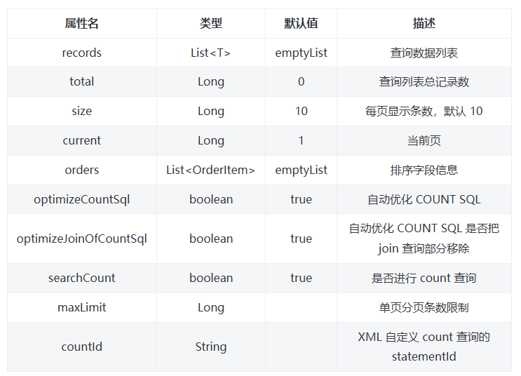

[TOC]

# 【README】

本文代码参见： [https://github.com/TomJourney/mybatis-plus-test](https://github.com/TomJourney/mybatis-plus-test)

本文部分内容总结自分页插件官方文档： [https://baomidou.com/plugins/pagination/](https://baomidou.com/plugins/pagination/) ; 

<br>

---

# 【1】MyBatisPlus分页插件介绍与基本用法

1）如何引用MyBatisPlus分页插件： 注册MyBatisPlus拦截器实例并新增分页内部拦截器到MyBatisPlus拦截器实例；

【MybatisPlusConfig】

```java
@Configuration
public class MybatisPlusConfig {

    /**
     * 添加分页插件
     */
    @Bean
    public MybatisPlusInterceptor mybatisPlusInterceptor() {
        MybatisPlusInterceptor interceptor = new MybatisPlusInterceptor();
        interceptor.addInnerInterceptor(new PaginationInnerInterceptor(DbType.MYSQL)); // 如果配置多个插件, 切记分页最后添加
        // 如果有多数据源可以不配具体类型, 否则都建议配上具体的 DbType
        return interceptor;
    }
}
```

## 【1.1】自定义 Mapper 方法中使用分页

```java
IPage<UserVo> selectPageVo(IPage<?> page, Integer state);
// 或者自定义分页类
MyPage selectPageVo(MyPage page);
// 或者返回 List
List<UserVo> selectPageVo(IPage<UserVo> page, Integer state);
```

【对应的 XML 配置】

```xml
<select id="selectPageVo" resultType="xxx.xxx.xxx.UserVo">
    SELECT id,name FROM user WHERE state=#{state}
</select>
```

>如果返回类型是 IPage，则入参的 IPage 不能为 null。如果想临时不分页，可以在初始化 IPage 时 size 参数传入小于 0 的值。 如果返回类型是 List，则入参的 IPage 可以为 null，但需要手动设置入参的 IPage.setRecords(返回的 List)。 如果 XML 需要从 page 里取值，需要使用 page.属性 获取。

【其他注意事项】

- 生成 countSql 时，如果 left join 的表不参与 where 条件，会将其优化掉。建议在任何带有 left join 的 SQL 中，都给表和字段加上别名。
- 在使用多个插件时，请将分页插件放到插件执行链的最后面，以避免 COUNT SQL 执行不准确的问题。

<br>

---

## 【1.2】Page 类(diy分页模型)

Page 类继承了 IPage 类，实现了简单分页模型。如果你需要实现自己的分页模型，可以继承 Page 类或实现 IPage 类。



<br>

---

### 【1.2.1】IService中的分页api

【IService】

```java
public interface IService<T> extends IRepository<T> {
    ...
}
```

【IRepository】

```java
default List<T> list(IPage<T> page, Wrapper<T> queryWrapper) {
    return this.getBaseMapper().selectList(page, queryWrapper);
}

default List<T> list() {
    return this.list((Wrapper)Wrappers.emptyWrapper());
}

default List<T> list(IPage<T> page) {
    return this.list(page, Wrappers.emptyWrapper());
}

default <E extends IPage<T>> E page(E page, Wrapper<T> queryWrapper) {
    return this.getBaseMapper().selectPage(page, queryWrapper);
}

default <E extends IPage<T>> E page(E page) {
    return this.page(page, Wrappers.emptyWrapper());
}

default List<Map<String, Object>> listMaps(Wrapper<T> queryWrapper) {
    return this.getBaseMapper().selectMaps(queryWrapper);
}

default List<Map<String, Object>> listMaps(IPage<? extends Map<String, Object>> page, Wrapper<T> queryWrapper) {
    return this.getBaseMapper().selectMaps(page, queryWrapper);
}

default List<Map<String, Object>> listMaps() {
    return this.listMaps((Wrapper)Wrappers.emptyWrapper());
}

default List<Map<String, Object>> listMaps(IPage<? extends Map<String, Object>> page) {
    return this.listMaps(page, Wrappers.emptyWrapper());
}
```

<br>

---

## 【1.2】分页查询代码

### 【1.2.1】分页查询用户

【MyBatisPlusPageQueryTest】

```java
@SpringBootTest
public class MyBatisPlusPageQueryTest {

    @Autowired
    private MyBatisPlusUserService userService;

    @Test
    void testPageQuery() {
        // 1 分页查询
        int pageNo = 1, pageSize = 5;
        // 1.1 分页参数
        Page<UserPO> pageParamDTO = Page.of(pageNo, pageSize);
        // 1.2 排序参数，通过 OrderItem 来指定
        pageParamDTO.addOrder(OrderItem.asc("balance"));
        // 1.3 分页查询
        Page<UserPO> pageQryResult = userService.page(pageParamDTO);

        // 2 总条数与总页数
        System.out.println("总条数 = " +pageQryResult.getTotal() + ", 总页数 = " + pageQryResult.getPages());

        // 3 分页数据
        List<UserPO> records = pageQryResult.getRecords();
        System.out.println("分页数据 = " + records);
    }
//==>  Preparing: SELECT COUNT(*) AS total FROM user_tbl WHERE deleted = '0'
//            ==> Parameters:
//            <==    Columns: total
//<==        Row: 19024
//            <==      Total: 1
//            ==>  Preparing: SELECT id, name, mobile_phone, addr, balance, user_state, deleted, info FROM user_tbl WHERE deleted = '0' ORDER BY balance ASC LIMIT ?
//            ==> Parameters: 5(Long)
}
```

【执行日志】

```c++
JDBC Connection [com.mysql.cj.jdbc.ConnectionImpl@b90c5a5] will not be managed by Spring
==>  Preparing: SELECT COUNT(*) AS total FROM user_tbl WHERE deleted = '0'
==> Parameters: 
<==    Columns: total
<==        Row: 19024
<==      Total: 1
==>  Preparing: SELECT id, name, mobile_phone, addr, balance, user_state, deleted, info FROM user_tbl WHERE deleted = '0' ORDER BY balance ASC LIMIT ?
==> Parameters: 5(Long)
<==    Columns: id, name, mobile_phone, addr, balance, user_state, deleted, info
<==        Row: 10000, user10000, 17712310000, 成都天府三街10000号, 0.00, null, 0, {"age":11,"nikeName":"zhangsan11"}
<==        Row: 123002, user0706_0, 13008d, 成都市天府六街第0号, 0.00, null, 0, {"age":11,"nikeName":"zhangsan11"}
<==        Row: 1, user1, 17612342701, 成都天府三街101号, 1.00, 1, 0, {"age":11,"nikeName":"zhangsan11"}
<==        Row: 2, user2, 110, 成都天府四街401号, 2.00, 0, 0, {"age":11,"nikeName":"zhangsan11"}
<==        Row: 3, user3, 17612342703, 成都天府三街103号, 3.00, 0, 0, {"age":11,"nikeName":"zhangsan11"}
<==      Total: 5
Closing non transactional SqlSession [org.apache.ibatis.session.defaults.DefaultSqlSession@614cd187]
总条数 = 19024, 总页数 = 3805
分页数据 = [UserPO(id=10000, name=user10000, mobilePhone=17712310000, addr=成都天府三街10000号, balance=0.00, userState=null, deleted=0, info=UserInfoPO(age=11, nikeName=zhangsan11)), UserPO(id=123002, name=user0706_0, mobilePhone=13008d, addr=成都市天府六街第0号, balance=0.00, userState=null, deleted=0, info=UserInfoPO(age=11, nikeName=zhangsan11)), UserPO(id=1, name=user1, mobilePhone=17612342701, addr=成都天府三街101号, balance=1.00, userState=ON, deleted=0, info=UserInfoPO(age=11, nikeName=zhangsan11)), UserPO(id=2, name=user2, mobilePhone=110, addr=成都天府四街401号, balance=2.00, userState=OFF, deleted=0, info=UserInfoPO(age=11, nikeName=zhangsan11)), UserPO(id=3, name=user3, mobilePhone=17612342703, addr=成都天府三街103号, balance=3.00, userState=OFF, deleted=0, info=UserInfoPO(age=11, nikeName=zhangsan11))]
```

<br>

---

