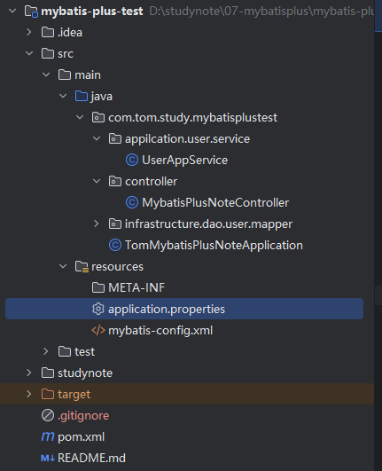
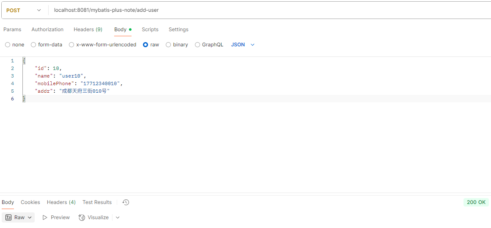

[TOC]

# 【README】

本文代码参见： [https://github.com/TomJourney/mybatis-plus-test](https://github.com/TomJourney/mybatis-plus-test)

本文集成了springboot与mybatis-plus，并提供了一个mybatis-plus的简单应用；

<font color=red>【使用MyBatisPlus的关键】springboot集成了mybatis的基础上，引入mybatis-plus就2步：</font>

- 步骤1）引入mybatis-plus依赖，删除 mybatis-spring-boot-starter 依赖；
- 步骤2）业务Mapper如UserMapper继承MyBatis-Plus中的BaseMapper；

【pom.xml中spring-mybatis与mybaits-plus依赖配置】

```xml
<!-- mybatis conf （新增mybatis-plus-boot-starter依赖，需要把mybatis-spring-boot-starter注释或删除，否则报包冲突）-->
<!--    <dependency>-->
<!--      <groupId>org.mybatis.spring.boot</groupId>-->
<!--      <artifactId>mybatis-spring-boot-starter</artifactId>-->
<!--      <version>3.0.3</version>-->
<!--    </dependency>-->
<dependency>
  <groupId>com.baomidou</groupId>
  <artifactId>mybatis-plus-boot-starter</artifactId>
  <version>3.5.12</version>
</dependency>
<dependency>
  <groupId>org.mybatis</groupId>
  <artifactId>mybatis-spring</artifactId>
  <version>3.0.3</version>
</dependency>
```

<br>

---

# 【1】springboot集成mybatis-plus配置

## 【1.1】目录结构



### 【相关说明】

本文项目使用了springboot, lombok，mybatis-plus；采用不规范的三层架构（为了求快），正式的生产环境不要参考本文代码；

补充：规范的代码应该是4层架构，包括adapter，app，domain，infra （有兴趣的同学参考ddd）；  

<br>

---

## 【1.2】代码示例

### 【pom.xml】 

```xml
<?xml version="1.0" encoding="UTF-8"?>
<project xmlns="http://maven.apache.org/POM/4.0.0" xmlns:xsi="http://www.w3.org/2001/XMLSchema-instance"
         xsi:schemaLocation="http://maven.apache.org/POM/4.0.0 https://maven.apache.org/xsd/maven-4.0.0.xsd">

  <modelVersion>4.0.0</modelVersion>

  <parent>
    <groupId>org.springframework.boot</groupId>
    <artifactId>spring-boot-starter-parent</artifactId>
    <version>3.3.5</version>
    <relativePath/> <!-- lookup parent from repository -->
  </parent>

  <groupId>com.tom.studynote</groupId>
  <artifactId>mybatis-plus-test</artifactId>
  <version>0.0.1-SNAPSHOT</version>
  <name>mybatis-plus-test</name>
  <description>mybatis-plus-test</description>
  <url/>

  <properties>
    <java.version>17</java.version>
  </properties>

  <dependencies>
    <dependency>
      <groupId>org.springframework.boot</groupId>
      <artifactId>spring-boot-starter-web</artifactId>
      <version>3.3.5</version>
    </dependency>

    <dependency>
      <groupId>mysql</groupId>
      <artifactId>mysql-connector-java</artifactId>
      <version>8.0.29</version>
    </dependency>
    <!--【数据库】数据库连接池-->
    <dependency>
      <groupId>com.alibaba</groupId>
      <artifactId>druid</artifactId>
      <version>1.2.11</version>
    </dependency>

    <dependency>
      <groupId>org.projectlombok</groupId>
      <artifactId>lombok</artifactId>
      <scope>provided</scope>
    </dependency>

    <!-- https://mvnrepository.com/artifact/org.mapstruct/mapstruct -->
    <dependency>
      <groupId>org.mapstruct</groupId>
      <artifactId>mapstruct</artifactId>
      <version>1.6.2</version>
    </dependency>

    <dependency>
      <groupId>org.mapstruct</groupId>
      <artifactId>mapstruct-processor</artifactId>
      <version>1.6.2</version>
    </dependency>

    <dependency>
      <groupId>org.springframework.boot</groupId>
      <artifactId>spring-boot-starter-test</artifactId>
      <scope>test</scope>
    </dependency>

    <!-- mybatis conf （新增mybatis-plus-boot-starter依赖，需要把mybatis-spring-boot-starter注释或删除，否则报包冲突）-->
    <!--    <dependency>-->
    <!--      <groupId>org.mybatis.spring.boot</groupId>-->
    <!--      <artifactId>mybatis-spring-boot-starter</artifactId>-->
    <!--      <version>3.0.3</version>-->
    <!--    </dependency>-->
    <dependency>
      <groupId>com.baomidou</groupId>
      <artifactId>mybatis-plus-boot-starter</artifactId>
      <version>3.5.12</version>
    </dependency>
    <dependency>
      <groupId>org.mybatis</groupId>
      <artifactId>mybatis-spring</artifactId>
      <version>3.0.3</version>
    </dependency>
  </dependencies>

  <build>
    <resources>
      <resource>
        <directory>src/main/java</directory>
        <includes>
          <include>**/*.xml</include>
        </includes>
      </resource>
      <resource>
        <directory>src/main/resources</directory>
      </resource>
    </resources>
    <plugins>
      <plugin>
        <groupId>org.springframework.boot</groupId>
        <artifactId>spring-boot-maven-plugin</artifactId>
      </plugin>
    </plugins>
  </build>

</project>
```

### 【application.properties】

```properties
server.port = 8081

# spring datasource conf
spring.datasource.url=jdbc:mysql://localhost:3306/mywarn?useUnicode=true&characterEncoding=utf-8&serverTimezone=Asia/Shanghai&useSSL=false
spring.datasource.driver-class-name=com.mysql.cj.jdbc.Driver
spring.datasource.username=root
spring.datasource.password=root
spring.datasource.type=com.alibaba.druid.pool.DruidDataSource

# druid
spring.datasource.druid.initial-size=1
spring.datasource.druid.max-active=5
spring.datasource.druid.min-idle=5
spring.datasource.druid.max-wait=60000

# mybatis conf
mybatis.mapper-locations=classpath:com/mybatisplustest/infrastructure/dao/**/*.xml
mybatis.config-location=classpath:mybatis-config.xml
check-config-location=true

# template path
spring.web.resources.static-locations=classpath:/templates

# mybaits-plus
mybatis-plus.configuration.log-impl=org.apache.ibatis.logging.stdout.StdOutImpl
```

【TomMybatisPlusNoteApplication】

```python
@SpringBootApplication
@MapperScan(basePackages = {"com.tom.study.mybatisplustest.infrastructure.dao"})
public class TomMybatisPlusNoteApplication {

    public static void main(String[] args) {
        SpringApplication.run(TomMybatisPlusNoteApplication.class, args);
    }
}
```

### 【MybatisPlusNoteController】

```java
@RestController
@RequestMapping("/mybatis-plus-note")
public class MybatisPlusNoteController {

    @Autowired
    private UserAppService userAppService;

    @GetMapping("/user/{id}")
    public UserPO findUserById(@PathVariable("id") String id) {
        return userAppService.findUserById(id);
    }

    @PostMapping(path = "/add-user", consumes = "application/json")
    public void addUser(@RequestBody UserPO userPO) {
        userAppService.saveNewUser(userPO);
    }
}
```

### 【UserAppService】

```java
@Service
public class UserAppService {

    @Autowired
    UserMapper userMapper;

    public UserPO findUserById(String id) {
        return userMapper.selectById(id);
    }

    public void saveNewUser(UserPO UserPO) {
        userMapper.insert(UserPO);
    }
}
```

### 【UserMapper】

<font color=red>【关键】业务Mapper-UserMapper只需要继承BaseMapper即可使用mybatis-plus 提供的api </font>；

```java
public interface UserMapper extends BaseMapper<UserPO> {
}
```

### 【UserPO】

```java
@Data
@TableName("user_tbl")
public class UserPO {
    private Long id;
    private String name;
    private String mobilePhone;
    private String addr;
}
```

### 【建表语句】

```sql
-- mywarn.user_tbl definition

CREATE TABLE `user_tbl` (
  `id` bigint(20) unsigned NOT NULL AUTO_INCREMENT COMMENT '主键',
  `name` varchar(255) CHARACTER SET utf8mb4 COLLATE utf8mb4_general_ci DEFAULT NULL COMMENT '用户名称',
  `mobile_phone` varchar(11) CHARACTER SET utf8mb4 COLLATE utf8mb4_general_ci DEFAULT NULL COMMENT '移动电话',
  `addr` varchar(255) CHARACTER SET utf8mb4 COLLATE utf8mb4_general_ci DEFAULT NULL COMMENT '地址',
  `user_state` char(4) CHARACTER SET utf8mb4 COLLATE utf8mb4_general_ci DEFAULT NULL COMMENT '用户状态/ON-在线/OFF-离线',
  `create_time` timestamp NOT NULL DEFAULT CURRENT_TIMESTAMP,
  `last_modify_time` timestamp NOT NULL DEFAULT CURRENT_TIMESTAMP ON UPDATE CURRENT_TIMESTAMP,
  PRIMARY KEY (`id`)
) ENGINE=InnoDB AUTO_INCREMENT=117 DEFAULT CHARSET=utf8mb4 COLLATE=utf8mb4_general_ci COMMENT='用户表';
```

<br>

---

# 【2】演示

请求路径：localhost:8081/mybatis-plus-note/add-user

报文：

```json
{
    "id": 10,
    "name": "user10",
    "mobilePhone": "17712340010",
    "addr": "成都天府三街010号"
}
```



<br>