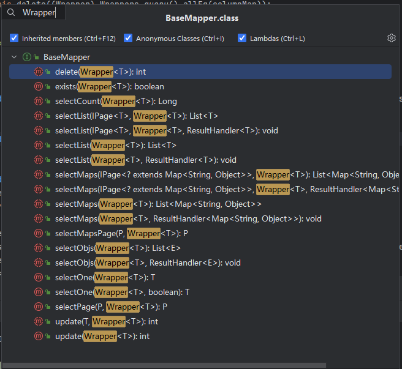

[TOC]

# 【README】

本文代码参见： [https://github.com/TomJourney/mybatis-plus-test](https://github.com/TomJourney/mybatis-plus-test)

本文集成了springboot与mybatis-plus；

本文主要内容如下：

- MybatisPlus-常见注解；
- MybatisPlus-常见配置；

<br>

---

# 【1】MyBatis-plus常见注解

【注解官方使用文档】[https://baomidou.com/reference/annotation/](https://baomidou.com/reference/annotation/) 

1）MybatisPlus通过扫描实体类，并基于反射获取po类信息作为数据库表信息；默认规则如下：

- 类名驼峰转下划线作为表名； 
- 名为id的字段作为主键；
- 变量名驼峰转下划线作为表的字段名； 

<font color=red>补充：若po类的字段与数据库表字段不满足上述默认规则，则需要使用注解来做自定义（这就是注解的作用，非常重要） </font>； 

2）注解（修饰po）：

- @TableName： 设置表名； 
- @TableId：指定表中的主键字段；
- @TableField：指定表中的普通字段；

```java
@Data
@TableName("user_tbl")
public class UserPO {
    @TableId("idXXX")
    private Long id;

    @TableField("nameXXX")
    private String name;

    private String mobilePhone;

    private String addr;
}
```

<br>

---

# 【2】MyBatis-Plus常见配置

mybatis-plus常见配置官方文档：[https://baomidou.com/reference/](https://baomidou.com/reference/)

## 【2.1】MyBatis-Plus配置示例

```properties
# 更多配置可以参考：  https://baomidou.com/reference/
# 别名扫描包
mybatis-plus.type-aliases-package=com.tom.study.mybatisplustest.infrastructure.dao

# mapper.xml路径
mybatis-plus.mapper-locations=classpath*:com.tom.study.mybatisplustest.infrastructure.dao/**/*.xml

# 配置
# 是否开启下划线和驼峰的映射
mybatis-plus.configuration.map-underscore-to-camel-case=true
# 是否开启二级缓存
mybatis-plus.configuration.cache-enabled=false

# 全局配置
# 更新策略： 只更新非空字段 
mybatis-plus.global-config.db-config.update-strategy=not_null
```

<br>

---

# 【3】MyBatisPlus核心内容

## 【3.1】条件构造器

1）MybatisPlus支持各种复杂的where条件，Wrapper类就是构建条件的包装器，该类定义了多种方法用于抽象sql条件（where子句）；




<br>

---

### 【3.1.1】业务场景-带多字段条件的查询

【业务场景】查询id大于100且名字包含6的用户

sql语句伪代码： select * from table where id > 100 and name like %6%；【说明：本sql仅供参考，生产环境不要使用】

【构建查询语句，封装到QueryWrapper】qryByCondition01()

```java
@Service
public class UserAppService {

    @Autowired
    UserMapper userMapper;
  

    public List<UserPO> qryByCondition01() {
        QueryWrapper<UserPO> userPOQueryWrapper = new QueryWrapper<UserPO>()
                .select("id", "name", "addr")
                .like("name", "6")
                .ge("id", 100);
        // 查询
        return userMapper.selectList(userPOQueryWrapper);
    }
}
```

【sql执行日志】 

```c++
==>  Preparing: SELECT id,name,addr FROM user_tbl WHERE (name LIKE ? AND id >= ?)
==> Parameters: %6%(String), 100(Integer)
<==    Columns: id, name, addr
<==        Row: 106, tr106, 成都市天府大道106号
<==        Row: 116, tr116, 成都市天府大道116号
<==      Total: 2
```

<br>

---

### 【3.1.2】业务场景-带条件的更新

【业务场景】根据name等于user2的用户的地址addr，手机号码mobilePhone； 

sql语句伪代码： update table set addr='XXX', mobile_phone='XXX' where name='user2'；【说明：本sql仅供参考，生产环境不要使用】

【构建更新的where子句，封装到QueryWrapper】updateByCondition02()

```java
public void updateByCondition2() {
    QueryWrapper<UserPO> updateWrapper = new QueryWrapper<UserPO>()
            .eq("name", "user2");
    UserPO userPO = new UserPO();
    userPO.setAddr("成都天府四街401号");
    userPO.setMobilePhone("110");
    userMapper.update(userPO, updateWrapper);
}
```

【sql执行日志】

```c++
JDBC Connection [com.mysql.cj.jdbc.ConnectionImpl@774e182c] will not be managed by Spring
==>  Preparing: UPDATE user_tbl SET mobile_phone=?, addr=? WHERE (name = ?)
==> Parameters: 110(String), 成都天府四街401号(String), user2(String)
<==    Updates: 1
```

<br>

---


